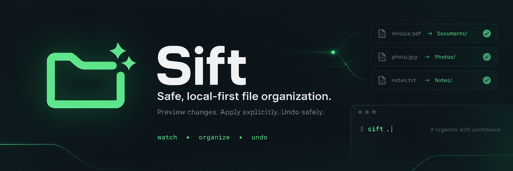
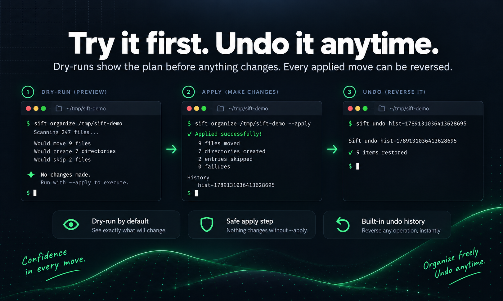
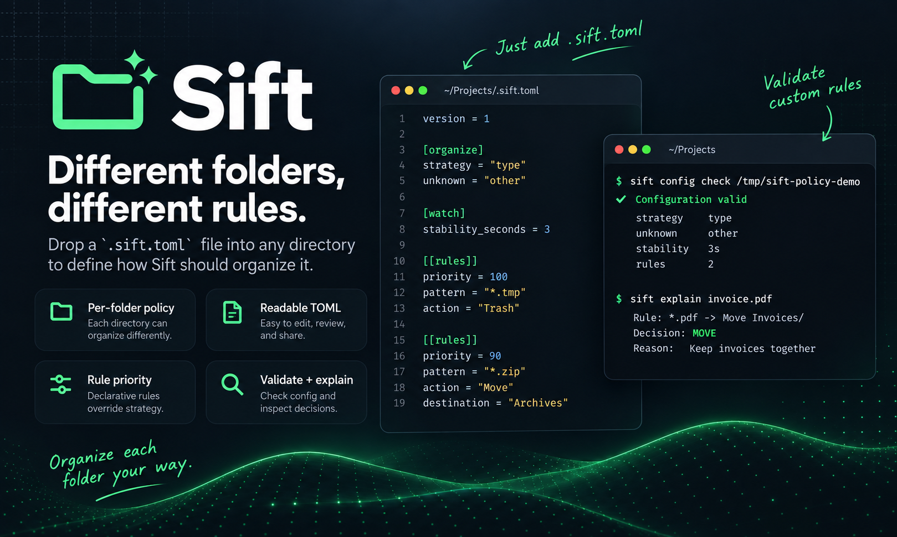
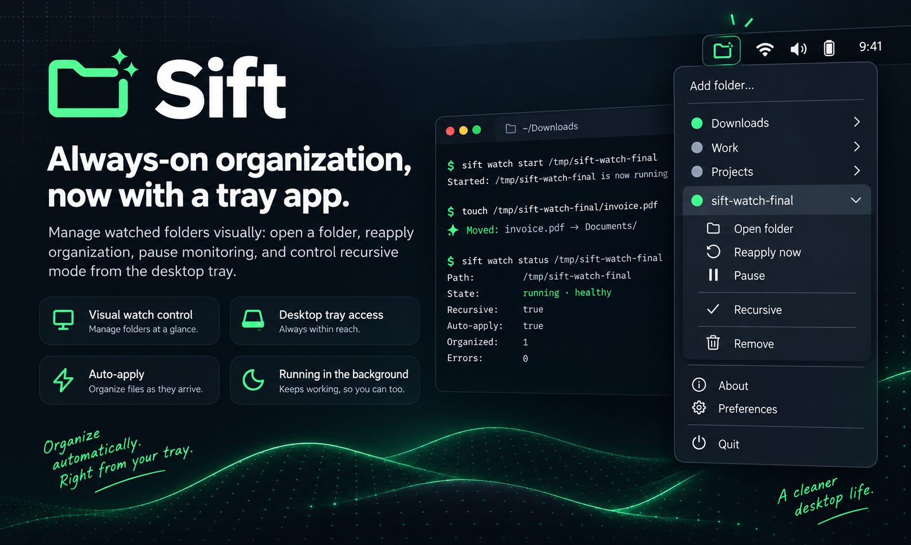

<p align="center">
  
</p>

<p align="center">
  <strong>Safe, local-first file organization.</strong>
</p>

<p align="center">
  Preview changes. Apply explicitly. Undo safely.<br>
  Keep messy folders organized without giving up control.
</p>

<p align="center">
  <a href="https://github.com/sergiocardoso/sift/actions/workflows/ci.yml">
    
  </a>
  <a href="https://github.com/sergiocardoso/sift/releases">
    
  </a>
  
  
  
</p>

<p align="center">
  <a href="#installation">Installation</a>
  ·
  <a href="#30-second-demo">Quick demo</a>
  ·
  <a href="#different-folders-different-rules">Rules</a>
  ·
  <a href="#watch--tray">Watch + Tray</a>
  ·
  <a href="#safety-model">Safety</a>
</p>

---

Sift is an open-source CLI for organizing messy directories **safely, predictably, and locally**.

It can preview changes, classify files, organize nested folders, diagnose risky entries, apply per-folder rules, keep history, undo successful moves, and continuously organize new files with **Sift Watch**.

```text
preview → understand → apply → undo
                         ↓
                       watch
```

No cloud required. No AI required. No silent filesystem changes.

```text
no --apply
→ no filesystem mutation
```

<p align="center">
  
</p>

## Why Sift?

| | |
|---|---|
| 🛡️ **Safe by default** | Plans are previews until you explicitly use `--apply`. |
| ↩️ **Undo built in** | Successful moves are recorded and can be safely reversed. |
| 🔍 **Explainable** | See why a file was classified, skipped, protected, or moved. |
| 📁 **Folder-aware** | Organize loose files or eligible folders without flattening directory context. |
| ⚙️ **Per-folder rules** | Drop a `.sift.toml` into a directory and give it its own policy. |
| ⚡ **Watch mode** | Turn selected folders into continuously organized inboxes. |
| 🖥️ **Tray app** | Manage watched folders visually without keeping a terminal open. |
| 🔒 **Local-first** | Core organization happens on your machine. |

Sift is deliberately conservative around important data:

- software projects are protected;
- hidden entries are left alone;
- symlinks are not followed for organization decisions;
- existing destinations are never silently overwritten;
- directory trees are not automatically merged;
- unsafe destination paths are rejected;
- cleanup uses the operating system trash;
- live filesystem assumptions are revalidated before mutation.

---

# 30-second demo

Imagine this directory:

```text
Downloads/
├── invoice.pdf
├── vacation.jpg
├── backup.zip
├── data.json
├── model.stl
├── experiment.rs
├── notes.xyz
└── my-project/
    ├── Cargo.toml
    └── src/
```

Preview first:

```bash
sift organize ~/Downloads
```

Sift can produce a plan like:

```text
invoice.pdf      → Documents/
vacation.jpg     → Images/
backup.zip       → Archives/
data.json        → Data/
model.stl        → 3D/
experiment.rs    → Code/
notes.xyz        → Other/
my-project/      → protected: software project

No changes made.
Run with --apply to execute.
```

Happy with the plan?

```bash
sift organize ~/Downloads --apply
```

```text
✓ Applied successfully

7 files moved
7 directories created
1 entry skipped
0 failures

History
  hist-...
```

Changed your mind?

```bash
sift undo hist-...
```

```text
✓ 7 items restored
```

<p align="center">
  
</p>

---

# Core features

## Organize

Build a deterministic organization plan for a directory.

```bash
# Current directory
sift

# Another directory
sift ~/Downloads

# Explicit command
sift organize ~/Downloads

# Apply after reviewing
sift organize ~/Downloads --apply
```

Built-in type classification includes:

```text
Documents/
Images/
Audio/
Video/
Archives/
3D/
Code/
Data/
Other/
```

Unknown ordinary files go to `Other/` by default.

### Recursive organization

Sift can organize eligible nested directories **in their own local context**:

```bash
sift organize ~/Downloads --recursive
sift organize ~/Downloads --recursive --apply
```

Given:

```text
Downloads/
├── invoice.pdf
└── Client A/
    ├── proposal.pdf
    └── logo.png
```

Recursive organization produces the equivalent of:

```text
Downloads/
├── Documents/
│   └── invoice.pdf
└── Client A/
    ├── Documents/
    │   └── proposal.pdf
    └── Images/
        └── logo.png
```

Sift does **not** flatten `Client A/proposal.pdf` into the root `Documents/` folder.

---

## Folders

`sift folders` reasons about immediate child folders from their contents rather than trusting the folder name.

```bash
sift folders ~/Downloads
```

Example:

```text
Plan
  3 folders to move
  1 suggestion
  1 protected
  1 uncertain

Move
  client-files/ → Documents/  100%
  print-jobs/   → 3D/         100%
  vacation/     → Images/     100%

Suggestions
  artwork/      → Images/      67% medium confidence

Protected
  my-app/       software project

Uncertain
  misc/         mixed content
```

The idea is simple:

```text
high confidence → plan the move
medium confidence → suggest
protected → leave alone
uncertain → leave alone
```

---

## Doctor

`doctor` is a read-only filesystem diagnostic.

```bash
sift doctor ~/Downloads
sift doctor ~/Downloads --recursive
sift doctor ~/Downloads --json
```

It can report:

- software projects;
- protected directories;
- symlinks;
- hidden entries;
- sensitive-looking filenames;
- files larger than 100 MB;
- archives older than one year;
- known build/dependency output directories such as `node_modules`, `target`, and `.venv`.

Example:

```text
Issues found

⚠ SLACK_TOKEN.txt
  Sensitive-looking filename

⚠ my-project/
  Software project detected — protected

⚠ some-link
  Symlink

3 findings
```

The sensitive-filename check is filename-based. Sift does not need to read file contents to report it.

---

## Clean

Find high-confidence junk and send it to the operating system trash when explicitly applied.

```bash
# Preview
sift clean ~/Downloads

# Apply
sift clean ~/Downloads --apply
```

Built-in junk candidates currently include:

```text
*.tmp
*.swp
*.swo
```

There is intentionally no `clean --recursive` today. Cleanup has a higher destructive risk, so Sift keeps that surface narrower.

> Trash actions are not restored by `sift undo`. Recovery belongs to the operating system trash.

---

## Explain

Ask Sift why it would make a specific decision.

```bash
sift explain ~/Downloads/invoice.pdf
```

Example:

```text
Policy
  built-in defaults

Strategy
  type

Classification
  .pdf → Document

Destination
  ~/Downloads/Documents/invoice.pdf

Decision
  MOVE
  Document

Safety
  ✓ regular file
  ✓ not protected
  ✓ destination available
  ✓ no symlink ancestor
  ✓ no collision

No changes were made.
```

With a custom rule, `explain` also shows the matching rule and reason.

---

## History and undo

Applied organization is recorded.

```bash
sift history
```

Reverse a recorded move operation:

```bash
sift undo hist-<operation-id>
```

Undo is intentionally defensive. Before restoring a file, Sift verifies that:

- the original path is still free;
- the moved destination still exists;
- the destination is still a regular file;
- the destination has not become a symlink;
- the destination has not become a directory.

If the live filesystem no longer matches those assumptions, Sift refuses the unsafe undo.

---

# Different folders, different rules

Every directory can have its own `.sift.toml`.

```text
~/Music/.sift.toml
~/Pictures/.sift.toml
~/Documents/.sift.toml
~/Downloads/.sift.toml
```

Generate a starter configuration:

```bash
sift init ~/Downloads
```

A policy can define the base strategy, Watch stability, and explicit rules:

```toml
version = 1

[organize]
strategy = "type"
unknown = "other"

[watch]
stability_seconds = 3

[[rules]]
enabled = true
priority = 100
pattern = "*.tmp"
action = "Trash"
description = "Trash all .tmp files"

[[rules]]
enabled = true
priority = 90
pattern = "*.zip"
action = "Move"
destination = "Archives"
description = "Move .zip to Archives"
```

Explicit enabled rules win over the strategy.

```text
explicit rule
     ↓
organize strategy
     ↓
built-in behavior
```

Validate the configuration:

```bash
sift config check ~/Downloads
```

Inspect a specific decision:

```bash
sift explain ~/Downloads/archive.zip
```

<p align="center">
  
</p>

## Rule actions

Rules support:

| Action | Meaning |
|---|---|
| `Move` | Move to a relative destination beneath the target directory |
| `Trash` | Send the matched file to the OS trash when applied |
| `Skip` | Explicitly leave the file untouched |

Higher `priority` values run first. The first enabled matching rule wins.

Destinations cannot escape the target directory. Absolute paths, `..`, unsafe root components, and symlink escapes are rejected.

---

# Metadata-driven strategies

Besides `strategy = "type"`, Sift supports strategies that derive destination folders from metadata.

| Strategy | Metadata source | Example |
|---|---|---|
| `date` | filesystem modification time | `{year}/{month}` |
| `audio` | audio tags | `{artist}/{album}` |
| `video` | video/container metadata | `{resolution}/{year}` |
| `photos` | EXIF metadata | `{camera}/{year}/{month}` |
| `documents` | PDF / Office metadata | `{author}/{year}` |

Rules still take precedence over the selected strategy.

## Date

```toml
[organize]
strategy = "date"
template = "{year}/{month}"
```

Supported placeholders:

```text
{year}
{month}
{day}
```

## Audio

```toml
[organize]
strategy = "audio"
template = "{artist}/{album}"
```

Supported metadata includes:

```text
{artist}
{album}
{album_artist}
{genre}
{track}
{title}
{year}
```

## Photos

```toml
[organize]
strategy = "photos"
template = "{camera}/{year}/{month}"
```

Sift reads EXIF metadata and supports:

```text
{camera}
{year}
{month}
{day}
```

There is intentionally no GPS/location placeholder.

## Documents

```toml
[organize]
strategy = "documents"
template = "{author}/{year}"
```

Supported placeholders:

```text
{author}
{title}
{year}
{month}
{day}
```

## Video

```toml
[organize]
strategy = "video"
template = "{resolution}/{year}"
```

Sift can read MP4/MOV container metadata without an external tool.

If `ffprobe` is installed, Sift can use it automatically for broader format support and additional metadata such as duration and FPS.

## Missing metadata

Missing metadata is a **skip**, never a guess.

If a template needs `{artist}` and the file has no artist tag, Sift skips that file with a reason instead of inventing a folder such as `Unknown Artist/`.

Use `sift explain <file>` to inspect the missing field.

## Recursive limitations

`audio`, `video`, `photos`, and `documents` currently do not support recursive organization.

A normal non-recursive `sift organize` and non-recursive Watch work normally with those strategies.

---

# Watch + Tray

Sift Watch turns selected folders into continuously organized inboxes.

Automatic mutation requires explicit persistent authorization:

```bash
--auto-apply
```

Register a folder:

```bash
sift watch add ~/Inbox --auto-apply
```

A newly registered watch starts in `stopped` state.

```text
add
 ↓
stopped
 ↓ start
running
 ↕
pause / resume
 ↓ stop
stopped
```

Start it:

```bash
sift watch start ~/Inbox
```

From then on, new stable eligible files can be organized automatically.

```text
invoice.pdf appears
        ↓
wait until stable
        ↓
evaluate policy
        ↓
Documents/invoice.pdf
```

Pre-existing files are **not** automatically backfilled by CLI Watch.

If you want existing content organized first:

```bash
sift organize ~/Inbox --apply
sift watch start ~/Inbox
```

## Watch lifecycle

```bash
sift watch list
sift watch status ~/Inbox
sift watch pause ~/Inbox
sift watch resume ~/Inbox
sift watch stop ~/Inbox
sift watch remove ~/Inbox
```

Important lifecycle guarantees:

- `start` / `resume` only return success after the daemon has confirmed that the root is actually being monitored;
- `pause` / `stop` wait for daemon teardown acknowledgement;
- filesystem events are associated with the Watch generation that observed them;
- automatic mutation revalidates that the Watch is still running and authorized before execution;
- files created while paused are not backfilled on resume.

## Why Watch waits before moving a file

A filesystem event does not mean a file has finished arriving.

Browsers, sync tools, and other applications may keep writing to a file for several seconds.

Sift therefore waits for a stability window before organizing a candidate.

Built-in default:

```text
2.5 seconds unchanged
```

A `.sift.toml` can override it:

```toml
[watch]
stability_seconds = 3
```

Accepted values are `1` through `300` seconds.

Common transient download names are ignored while temporary:

```text
.crdownload
.part
.download
.tmp
```

---

## Optional `sift-tray`

`sift-tray` is a small separate desktop UI for Linux and macOS.

It lists watched folders and lets you:

- open a watched folder;
- pause or resume it;
- reapply organization immediately;
- toggle recursive mode where supported;
- remove the watch;
- see the current Watch state.

The tray app is intentionally thin: it uses the same Sift library and Watch registry rather than implementing a second organization engine.

<p align="center">
  
</p>

### Tray authorization behavior

Adding a folder through the tray is a deliberate authorization action.

Unlike CLI `watch add`, the tray performs one real organization pass on the folder's existing contents before starting Watch, so a folder picked in the tray is organized immediately and then kept organized from that point forward.

### Install from a release

GitHub Releases include prebuilt `sift-tray` archives for:

```text
Linux x86_64
macOS x86_64
macOS aarch64
```

Extract `sift-tray` next to the `sift` binary or put it somewhere on `PATH`.

`install.sh` does not install the tray automatically yet.

### Build from source

```bash
cargo build -p sift-tray --release
./target/release/sift-tray
```

On Debian/Ubuntu:

```bash
sudo apt-get install libgtk-3-dev libayatana-appindicator3-dev libxdo-dev
```

### Best-effort auto-launch

When `sift-tray` is installed next to `sift` or available on `PATH`, `sift watch start` and `sift watch resume` try to launch it automatically.

This is silent and best-effort:

- Watch still succeeds if the tray is not installed;
- headless environments do not fail because there is no display;
- only one tray instance runs at a time.

---

# Installation

## Install script

```bash
curl -fsSL https://raw.githubusercontent.com/sergiocardoso/sift/main/install.sh | sh
```

The installer downloads the latest prebuilt release for the supported OS/architecture, verifies its SHA256 checksum, and installs `sift` to:

```text
~/.local/bin/sift
```

It never requires `sudo`.

Prebuilt CLI releases currently target Linux and macOS on x86_64/aarch64.

## Build from source

```bash
git clone https://github.com/sergiocardoso/sift.git
cd sift
cargo build --release
```

Run:

```bash
./target/release/sift --help
```

Or install locally:

```bash
cargo install --path .
```

Then:

```bash
sift --help
```

---

# Quick start

```bash
# Safe preview of current directory
sift

# Safe preview of another directory
sift ~/Downloads

# Inspect entries
sift scan ~/Downloads

# Preview organization
sift organize ~/Downloads

# Apply
sift organize ~/Downloads --apply

# Recursive organization
sift organize ~/Downloads --recursive

# Analyze child folders
sift folders ~/Downloads

# Diagnose filesystem findings
sift doctor ~/Downloads

# Preview junk cleanup
sift clean ~/Downloads

# Apply cleanup
sift clean ~/Downloads --apply

# Explain a decision
sift explain ~/Downloads/invoice.pdf

# Validate local policy
sift config check ~/Downloads

# Show history
sift history
```

---

# Command overview

| Command | Purpose | Mutates? |
|---|---|---:|
| `sift [path]` | Safe organization preview | No |
| `sift scan [path]` | Inspect directory entries | No |
| `sift organize [path]` | Build an organization plan | Only with `--apply` |
| `sift folders [path]` | Classify immediate child folders by contents | Only when explicitly applied |
| `sift clean [path]` | Build a cleanup plan | Only with `--apply` |
| `sift doctor [path]` | Report filesystem findings | No |
| `sift explain <file>` | Explain one organization decision | No |
| `sift config check [path]` | Validate the effective configuration | No |
| `sift history` | Show recorded operations | No |
| `sift undo <id>` | Reverse successful recorded moves | Yes |
| `sift init [path]` | Create a starter `.sift.toml` | Yes |
| `sift watch ...` | Manage continuous organization | Explicit authorization required |

Use built-in help for the exact current flags:

```bash
sift --help
sift organize --help
sift folders --help
sift clean --help
sift doctor --help
sift explain --help
sift config --help
sift watch --help
```

---

# File classification

Built-in `type` classification is deterministic and case-insensitive by extension.

| Category | Destination | Examples |
|---|---|---|
| Documents | `Documents/` | pdf, txt, md, docx, xlsx, pptx, epub |
| Images | `Images/` | jpg, png, webp, svg, heic, avif |
| Audio | `Audio/` | mp3, wav, flac, m4a, ogg, opus |
| Video | `Video/` | mp4, mov, mkv, webm, m4v |
| Archives | `Archives/` | zip, rar, 7z, tar, gz, xz |
| 3D | `3D/` | stl, obj, 3mf, step, blend, fbx, glb |
| Code | `Code/` | js, ts, py, rs, go, dart, sh, java |
| Data | `Data/` | json, yaml, toml, csv, xml, sql, sqlite |
| Other | `Other/` | ordinary unmatched files |
| Junk | OS trash candidate | tmp, swp, swo |

Sift does not read file contents for the built-in type classifier.

---

# Project and traversal protection

A directory containing common project markers is treated as a software project root.

Markers include:

```text
.git
Cargo.toml
package.json
pyproject.toml
pubspec.yaml
```

Recursive traversal also stops at known build/dependency output directories such as:

```text
node_modules
target
.venv
```

And it avoids descending into Sift's own category directories:

```text
Documents
Images
Audio
Video
Archives
3D
Code
Data
Other
```

This prevents repeated nesting such as:

```text
Documents/Documents/file.pdf
```

---

# Configuration lookup

For a command targeting `PATH`, Sift currently resolves configuration in this order:

```text
1. PATH/.sift.toml
2. platform config directory / sift / config.toml
3. built-in defaults
```

On a typical Linux system the global path is similar to:

```text
~/.config/sift/config.toml
```

Sift does not currently walk parent directories looking for additional `.sift.toml` files.

For recursive organization, the configuration selected for the command root is used for that operation.

Watch resolves configuration from the registered Watch root.

---

# Safety model

Safety is part of Sift's architecture, not an optional mode.

## Dry-run first

```bash
sift organize ~/Downloads
```

shows the plan.

```bash
sift organize ~/Downloads --apply
```

executes it.

## No silent overwrite

If the destination already exists, the move is skipped.

That includes an existing:

- file;
- directory;
- symlink;
- broken symlink.

## Symlink safety

Sift uses no-follow metadata for safety-sensitive filesystem checks.

Symlinks are treated as occupied/protected filesystem entries rather than followed as normal targets.

## No automatic directory merge

Sift does not merge directory trees simply because destination names match.

## Project roots are protected

Running organization against a recognized software project protects the project contents instead of dismantling the project into categories.

## Live revalidation

Planning-time assumptions are checked again immediately before mutation.

## No copy-delete fallback

If a rename cannot be performed safely, Sift does not silently replace it with copy-then-delete.

## Trash, not permanent deletion

Cleanup uses the operating system trash.

---

# JSON output and scripting

Machine-readable JSON is available for several command groups, including:

```text
scan
organize
clean
doctor
watch list
watch status
```

Example:

```bash
sift organize ~/Downloads --json | jq .
```

Update notices, when enabled, are written to stderr so they do not corrupt JSON stdout.

---

# Update notices and network behavior

Sift's core organization is local-first and does not require a cloud service.

The optional update check is the exception.

At most once every 24 hours, Sift may spawn a detached background check for a newer GitHub release. The command that triggers the check does not wait for the network request.

Disable update checks completely:

```bash
export SIFT_NO_UPDATE_CHECK=1
```

Without the update check, core Sift operations require no network access.

---

# Platform support

## Linux

Supported by prebuilt CLI releases.

`sift-tray` is currently released for Linux x86_64.

## macOS

Supported by prebuilt CLI releases for x86_64 and Apple Silicon.

`sift-tray` is also released for both architectures.

## Windows

There is currently no official Windows release.

Most non-Watch functionality is built on portable Rust filesystem APIs and the cross-platform trash crate, but native Windows support is not yet considered an officially tested/supported target.

Watch's detached daemon requires platform-specific process work before Windows can be officially supported.

---

# Suggested workflows

## Keep Downloads manageable manually

```bash
sift organize ~/Downloads
sift organize ~/Downloads --apply
sift history
```

## Inspect before organizing

```bash
sift scan ~/Desktop --recursive
sift doctor ~/Desktop --recursive
sift organize ~/Desktop --recursive
```

## Create a custom Downloads policy

```bash
sift init ~/Downloads
$EDITOR ~/Downloads/.sift.toml
sift config check ~/Downloads
sift organize ~/Downloads
```

## Different strategies for different libraries

```text
~/Music/.sift.toml       audio       → {artist}/{album}
~/Pictures/.sift.toml    photos      → {camera}/{year}/{month}
~/Documents/.sift.toml   documents   → {author}/{year}
~/Downloads/.sift.toml   type        → Documents/Images/Audio/...
```

## Turn an Inbox into a Smart Inbox

```bash
mkdir -p ~/Inbox
sift watch add ~/Inbox --auto-apply
sift watch start ~/Inbox
sift watch status ~/Inbox
```

---

# Architecture

The core pipeline intentionally separates observation, planning, execution, and history.

```text
Filesystem
   │
   ▼
Scanner
   │
   ▼
Classifier / metadata strategy
   │
   ▼
Rules / policy
   │
   ▼
Planner
   │
   ▼
Review
   │
   ▼
Executor
   │
   ▼
History
   │
   ▼
Undo
```

The scanner does not mutate the filesystem.

The planner decides what should happen.

The executor applies only explicitly authorized plans and revalidates safety assumptions immediately before mutation.

Watch reuses the same organization authority instead of implementing a separate, weaker organizer.

## Project layout

```text
src/
├── classifier.rs
├── cli.rs
├── config.rs
├── domain.rs
├── executor.rs
├── fs.rs
├── history.rs
├── planner.rs
├── render.rs
├── scanner.rs
├── utils.rs
└── watch/
    ├── daemon.rs
    ├── eligibility.rs
    ├── engine.rs
    ├── platform.rs
    ├── registry.rs
    └── stability.rs

sift-tray/
└── ...
```

---

# Development

Run the full local quality gate:

```bash
cargo fmt --check
cargo check --all-targets
cargo clippy --all-targets --all-features -- -D warnings
cargo test
```

Build the CLI:

```bash
cargo build --release
```

Build the optional tray app:

```bash
cargo build -p sift-tray --release
```

---

# Contributing

Contributions are welcome.

Before opening a pull request, please make sure the project is:

```text
formatted
lint-clean
building
passing tests
```

See:

- [`CONTRIBUTING.md`](CONTRIBUTING.md) for contribution guidance;
- [`SECURITY.md`](SECURITY.md) for security reports.

---

# License

Sift is licensed under the [Apache License 2.0](LICENSE).

Copyright 2026 Sérgio Cardoso.
